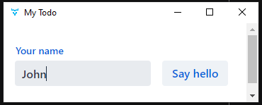

# Vaadin-Desktop-App
Template to create a Windows/Linux/Mac desktop app with a server-side UI
and HTML frontend within minutes. **Keep in mind that this project is still in beta.**

To get started clone this repo and run the `start` task in your IDE:

  

It creates a shaded jar and runs it (you can also double click it).

**TODO for stable release:**
- Executables for Windows/Linux/Mac via JavaPackager. Currently, only
  a shaded .jar gets generated that can be double-clicked to open the window
  (first time takes a bit since jcef gets downloaded).
- Bundle jcef with installer to avoid waiting at first launch.
- Minimize shaded jar to save disk space.
- Install jcef globally to save disk space.
- Fix few seconds of blank screen on first page load.
- Fix high memory usage.

**How?**

It uses JCEF (Java Chromium Embedded Framework) to render HTML/CSS and
run JavaScript on the client-side. On the "server-side" (which is also on the client
since this is a regular desktop app) Java/Vaadin is used.

For details about prerequisites, deploying to production, project structure,
etc. head over to either https://github.com/vaadin/base-starter-spring-gradle
if you chose Gradle, or https://github.com/vaadin/flow-quickstart-tutorial
for Maven.

**Features**
- Cross-platform by downloading platform dependent dependencies at first run (JCEF).
- Various utility methods and classes to make layout creation and window management easier.
- Support for Gradle and Maven build tools.
- GitHub actions/workflows for testing and deployment.